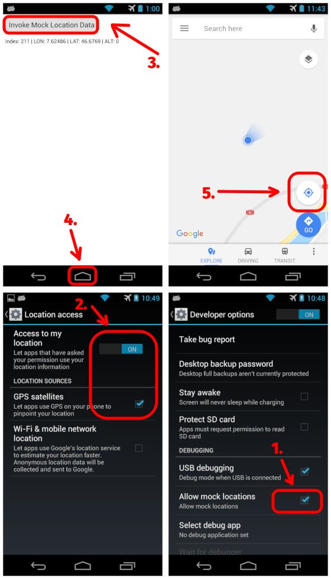

QmlDestroyTest
==============



A simple QML example for Android OS that demonstrates Mock Location tricks:

1. Important! Enable "Allow mock locations" in the "Developer options".
2. Enable "Access to my location" and "GPS satellites" in the "Location access".
3. Run "QmlDestroyTest" app and push "Invoke Mock Location Data" button.
4. Minimize an app window by "Home" button or in other ways.
5. Run "Google Maps" or "Maps" application and push "Locate me!" button.

Use `javah` utility for generaring new JNI-header file if your `NativeHelper.java` class was changed:

```bash
$ pwd
~/QmlDestroyTest/android/src
$ javah ru.exlmoto.qmldestroytest.NativeHelper
$ mv *.h ../..
```

Enjoy!

Additional information:
1. Stack Overflow: [Mock location not working on Google map](https://stackoverflow.com/questions/29368519/mock-location-not-working-on-google-map).
2. Linux.org.ru: [A creating of Mock Location Provider in Qt/QML: a strange Segmenatation fault](https://www.linux.org.ru/forum/development/14728416).
