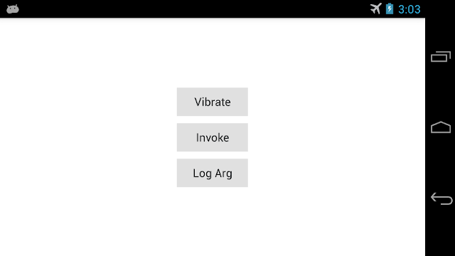

QmlDestroyTest
==============



A simple QML example for Android OS that demonstrates various geek perverts:

1. QML => C++ connections (*Vibrate*/*Invoke*/*Log Arg* buttons).
2. QML => C++ => JNI => Java connection (*Vibrate* button).
3. QML => C++ => JNI => Java => JNI => C++ connection (*Invoke* button).
4. Java => JNI => C++ connection (`onStop()` Java-method).
5. Custom Java class inheritor.
6. Overriding various Java/Android activity methods.
7. Vibration signal.
8. Using Music Stream for Volume keys.
9. Deploy custom files to the APK-package (e. g. edited AndroidManifest.xml and Java-classes).
10. Generating special JNI-header file for Java => JNI => C++ binding.
11. QSettings autism.

Use `javah` utility for generaring new JNI-header file if your `NativeHelper.java` class was changed:

```bash
$ pwd
~/QmlDestroyTest/android/src
$ javah ru.exlmoto.qmldestroytest.NativeHelper
$ mv *.h ../..
```

Enjoy!
