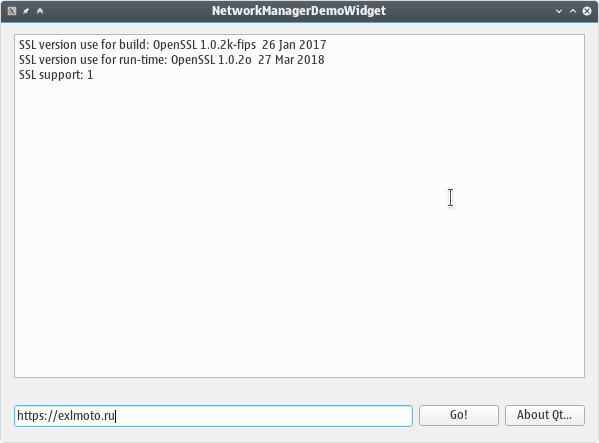

QtNetworkManager Demo
=====================

An example of using the OpenSSL library with Qt framework.


For the Qt from the official site (which compiled with the OpenSSL v1.0.x):

```bash
$ git clone https://github.com/EXL/Stuff
$ cd Stuff/Examples/Qt-OpenSSL-NetworkManager/
$ /opt/Qt5.10.1/5.10.1/gcc_64/bin/qmake NetworkManagerDemo.pro
$ make
$ ls /usr/lib/openssl-1.0/ -al
total 256
drwxr-xr-x   4 root root   4096 Apr  9 16:17 .
drwxr-xr-x 203 root root 245760 May 19 22:59 ..
drwxr-xr-x   2 root root   4096 Apr  9 16:17 engines
lrwxrwxrwx   1 root root     21 Mar 31 23:45 libcrypto.so -> ../libcrypto.so.1.0.0
lrwxrwxrwx   1 root root     18 Mar 31 23:45 libssl.so -> ../libssl.so.1.0.0
drwxr-xr-x   2 root root   4096 Apr  9 16:17 pkgconfig
LD_LIBRARY_PATH=/usr/lib/openssl-1.0/:$LD_LIBRARY_PATH ./NetworkManagerDemo
```


(c) [itnotesblog.ru](http://itnotesblog.ru/note.php?id=250)
