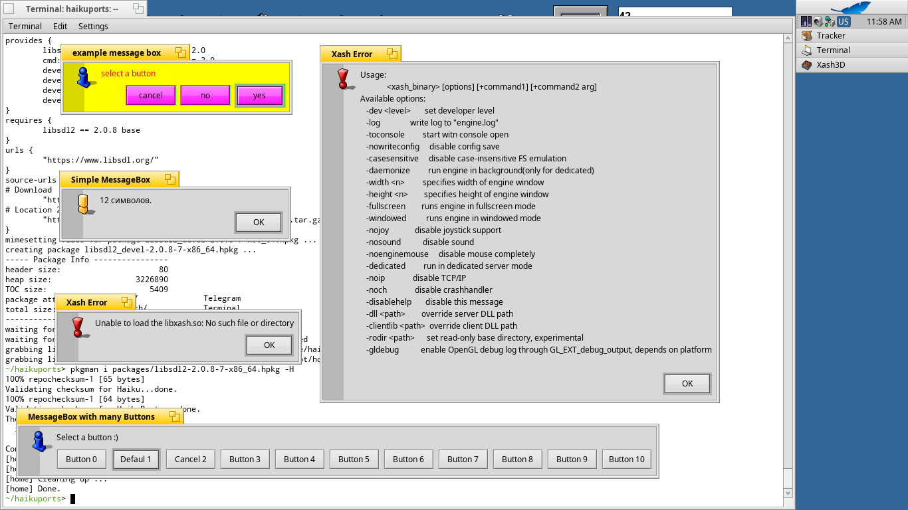

SDL2 MessageBox Utility
=======================

Utility for testing `SDL_ShowSimpleMessageBox()` and `SDL_ShowMessageBox()` functions in the SDL2 library. Written specially to Haiku's port of SDL2 library.

